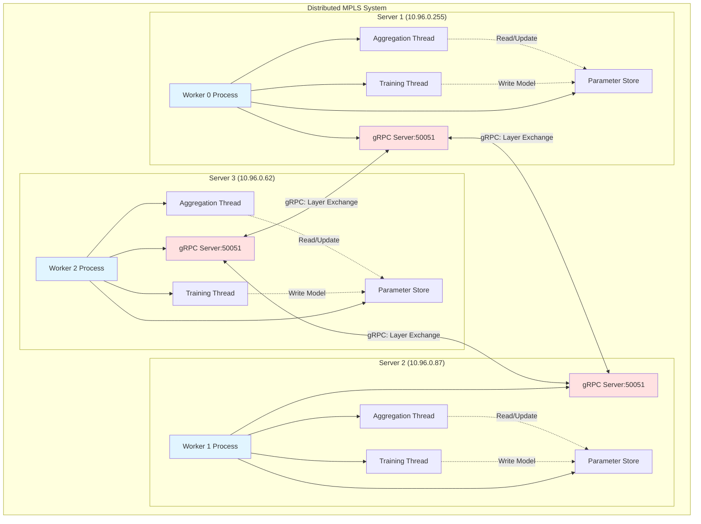
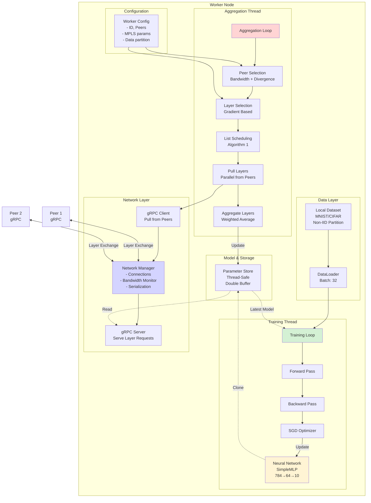
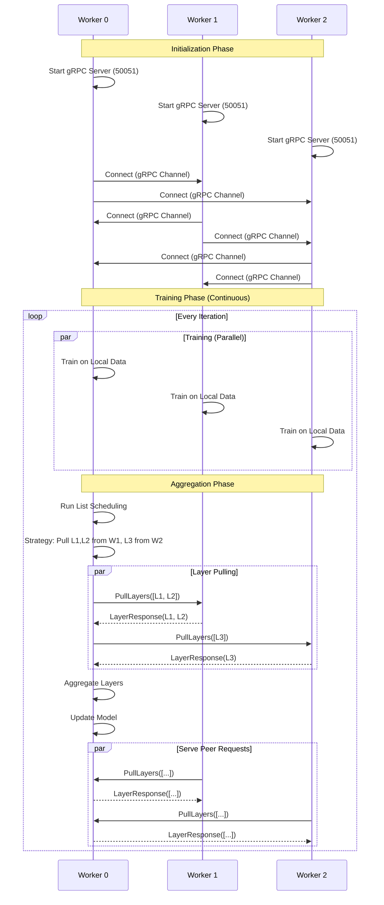
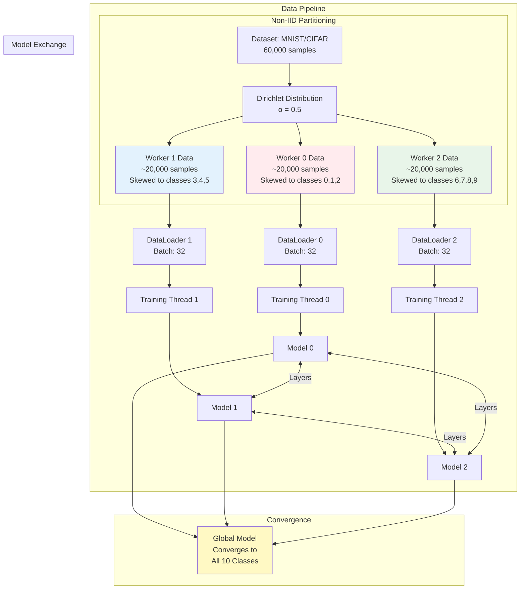
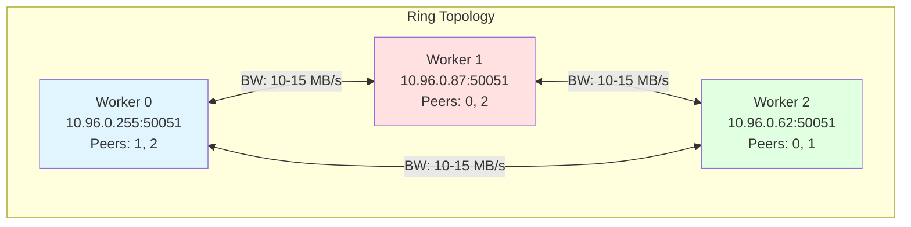
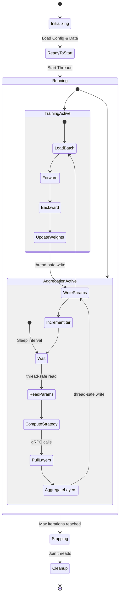
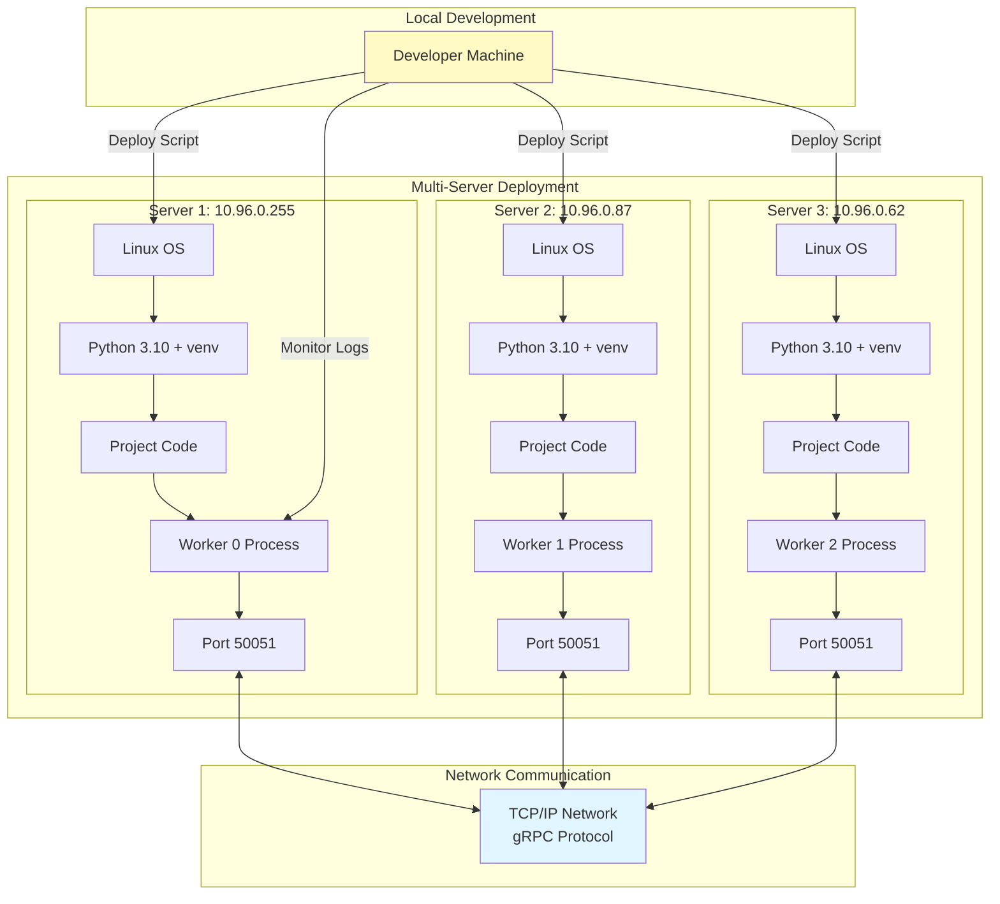

# MPLS Distributed System Architecture

## 1. Overall System Architecture



## 2. Single Worker Internal Architecture



## 3. MPLS Algorithms Flow

```mermaid
graph LR
    subgraph "MPLS Core Algorithms"
        START[Aggregation Round] --> UPDATE_META[Update Peer Metadata]
        
        UPDATE_META --> PEER_ALG[Peer Selection Algorithm]
        
        subgraph "Peer Selection (Eq. 4)"
            PEER_ALG --> BW[Measure Bandwidth<br/>B_s for each peer]
            PEER_ALG --> DIV[Compute Data Divergence<br/>DD_s for each peer]
            BW --> NORM1[Normalize: B̄_s]
            DIV --> NORM2[Normalize: D̄D_s]
            NORM1 --> COMBINE[Score = τ₁·B̄_s + τ₂·D̄D_s]
            NORM2 --> COMBINE
            COMBINE --> PROB_P[Peer Probabilities p_s]
        end
        
        PROB_P --> LAYER_ALG[Layer Selection Algorithm]
        
        subgraph "Layer Selection (Eq. 6)"
            LAYER_ALG --> GRAD[Gradient Variation<br/>g_s^(t',t)(l)]
            GRAD --> NORM3[Normalize per layer]
            NORM3 --> PROB_L[Layer Probabilities q_s(l)]
        end
        
        PROB_L --> SCHED_ALG[List Scheduling Algorithm]
        
        subgraph "List Scheduling (Alg. 1)"
            SCHED_ALG --> INIT[Initialize μ₁, μ₂ matrices]
            INIT --> EFFICIENCY[Compute Efficiency E(s,l)]
            EFFICIENCY --> RANK[Rank Peers by Σ E(s,l)]
            RANK --> ASSIGN1[Phase 1: Assign each layer<br/>to best peer]
            ASSIGN1 --> ASSIGN2[Phase 2: Fill gaps<br/>without exceeding max load]
            ASSIGN2 --> STRATEGY[Aggregation Strategy<br/>π: layer → peer]
        end
        
        STRATEGY --> PULL_EXEC[Execute: Pull Layers<br/>in Parallel]
        PULL_EXEC --> AGG_EXEC[Aggregate Layers]
        
        subgraph "Model Aggregation (Eq. 1)"
            AGG_EXEC --> AVG[w_i^(k+1)(l) = <br/>(Σ y_s^k(l)·w_s^k(l) + w_i^k(l))<br/>/ (Σ y_s^k(l) + 1)]
        end
        
        AVG --> END[Updated Model]
    end
    
    style PEER_ALG fill:#e3f2fd
    style LAYER_ALG fill:#f3e5f5
    style SCHED_ALG fill:#e8f5e9
    style AGG_EXEC fill:#fff3e0
```

## 4. Communication Protocol



## 5. Data Flow Architecture



## 6. Network Topology (Ring)



## 7. Thread Interaction & Synchronization



## 8. File System Architecture

```
mpls_dfl_python/
│
├── src/                          # Source code
│   ├── distributed/              # Distributed implementation
│   │   ├── worker.py            # DistributedWorker class
│   │   ├── network.py           # gRPC communication
│   │   ├── config_loader.py     # Configuration management
│   │   ├── worker_runner.py     # Standalone runner
│   │   └── mpls_service_pb2.py  # Generated protobuf
│   ├── workers.py               # MPLS/APPG/NetMax algorithms
│   ├── model.py                 # Neural network models
│   ├── config.py                # Base configuration
│   └── runner.py                # Simulation runner
│
├── proto/
│   └── mpls_service.proto       # gRPC service definition
│
├── scripts/
│   ├── generate_configs.py      # Config generator
│   ├── run_distributed.py       # Multi-process runner
│   └── deploy_remote.sh         # Remote deployment
│
├── configs/
│   ├── remote/                  # Remote server configs
│   │   ├── worker_0.yaml       # Server 1 config
│   │   ├── worker_1.yaml       # Server 2 config
│   │   └── worker_2.yaml       # Server 3 config
│   └── example_*.yaml          # Example configs
│
├── logs/                        # Worker logs (runtime)
├── data/                        # MNIST/CIFAR datasets (runtime)
├── Dockerfile                   # Container image
├── docker-compose.yml           # Multi-container orchestration
└── requirements*.txt            # Dependencies
```

## 9. Deployment Architecture



## Key Components Summary

| Component | Description | Location |
|-----------|-------------|----------|
| **DistributedWorker** | Main worker class with async threads | `src/distributed/worker.py` |
| **NetworkManager** | gRPC client/server management | `src/distributed/network.py` |
| **MPLS Algorithms** | Peer/layer selection, list scheduling | `src/distributed/worker.py:350-489` |
| **gRPC Service** | Protocol definitions | `proto/mpls_service.proto` |
| **Config System** | YAML-based configuration | `src/distributed/config_loader.py` |
| **Deployment** | Remote server deployment | `scripts/deploy_remote.sh` |

## Technology Stack

- **Communication**: gRPC (Protocol Buffers)
- **Deep Learning**: PyTorch
- **Data**: torchvision (MNIST, CIFAR)
- **Serialization**: NumPy + Protobuf
- **Configuration**: PyYAML
- **Deployment**: Python multiprocessing / Docker
- **Monitoring**: File-based logging
